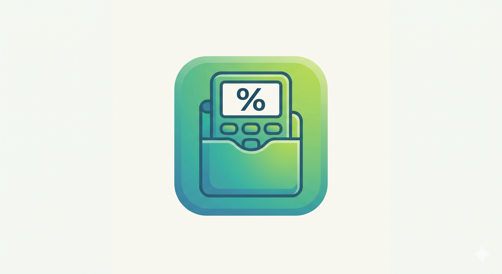

# PocketCA 💰

PocketCA is an intelligent, modern personal finance application designed specifically to help you manage your monthly allowance or pocket money. Stop stressing about your budget—tell our engine what you earn, what you must spend on fixed costs, and your savings goals, and PocketCA will perfectly balance your flexible spending for the rest of the month.

 *(Placeholder for your preview image)*

## ✨ Key Features

- **Smart Onboarding & AI Allocation**: Answer a few quick questions and our allocation engine automatically divides your flexible spending into smart, tailored categories (Food, Shopping, Travel, Misc).
- **The Flex Slider**: Dynamically warp your budget in real-time by adjusting your target savings percentage. See exactly how increasing your savings affects your daily coffee fund!
- **Fixed Expense Tracking**: Automatically sets aside money for mandatory, non-negotiable costs (like rent or subscriptions) so you never get a false sense of financial security.
- **End-of-Month Reality Check**: Log your daily transactions and compare your actual spending head-to-head against your recommended AI model using gorgeous, interactive charts.
- **Fully Local & Secure**: No backend required out of the box! PocketCA uses a custom LocalStorage database adapter to handle full user authentication, session persistence, and ledger management natively in your browser.

## 🚀 Technology Stack

PocketCA is built with modern web technologies focused on speed, type-safety, and incredible UI aesthetics:
- **Core**: React 18 & TypeScript
- **Build Tool**: Vite (Lightning fast HMR & bundling)
- **Styling**: Tailwind CSS (Fully responsive, vibrant color tokens, glassmorphism, and micro-animations)
- **Routing**: React Router DOM (Protected routes & Auth Guards)
- **Data Visualization**: Recharts (Customized progressive bar charts)
- **Icons**: Lucide React

## 💻 Getting Started

### Prerequisites
Make sure you have [Node.js](https://nodejs.org/) installed on your machine.

### Installation

1. **Clone the repository:**
   ```bash
   git clone https://github.com/atharva-mogre/PocketCA.git
   cd PocketCA
   ```

2. **Install dependencies:**
   ```bash
   npm install
   ```

3. **Start the development server:**
   ```bash
   npm run dev
   ```

4. **Open the app:**
   Navigate to `http://localhost:5173` in your browser.

## 📂 Project Architecture

```
src/
├── api/
│   └── dbAdapter.ts        # Simulated database logic, LocalStorage tables & auth functions
├── assets/                 # Local images, SVG assets, and vectors
├── components/
│   ├── Navbar.tsx          # Main application navigation
│   └── AuthGuard.tsx       # Route protection wrappers for authenticated users
├── context/
│   └── AuthContext.tsx     # Global authentication state provider
├── hooks/
│   └── useDatabase.ts      # Custom React hooks bridging UI components to the dbAdapter
├── pages/
│   ├── LandingPage.tsx     # Animated, highly converted intro screen
│   ├── Login.tsx           # User authentication login
│   ├── Signup.tsx          # Account creation flow
│   ├── Onboarding.tsx      # Multi-step wizard to setup initial budget plans
│   └── Dashboard.tsx       # Core application workspace for logging & visualizing spending
└── types/
    └── index.ts            # Global TypeScript interfaces
```

## 🤝 Contributing
Contributions, issues, and feature requests are welcome! 
If you want to contribute, feel free to fork the repository and submit a pull request.

## 📄 License
This project is open-source and available under the [MIT License](LICENSE).
